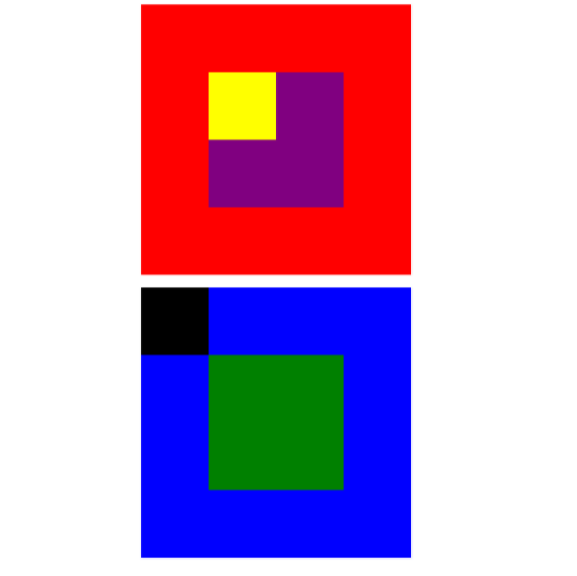
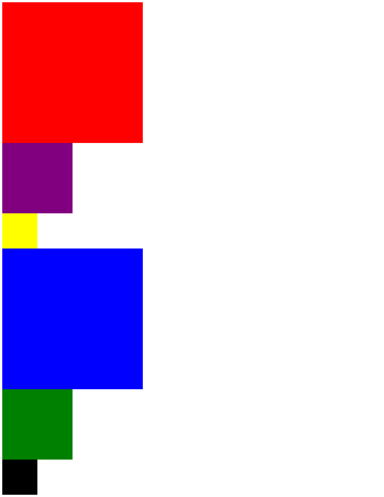
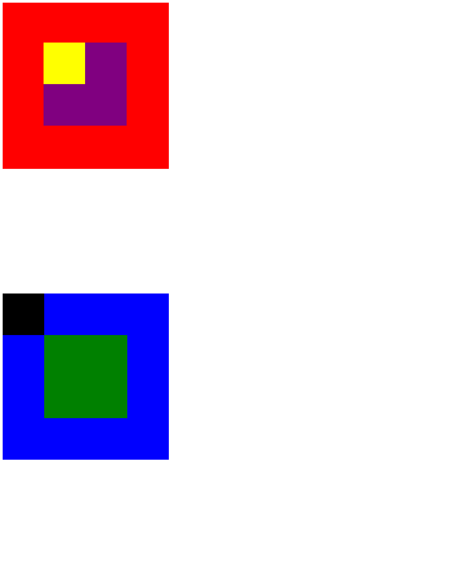

### Proyecto: "Posicionamiento de Cajas" ###

--------------------------------------------------------------

1) __Objetivo__

  Para este proyecto nos indican que debemos posiconar las cajas de forma que nos quede de la siguiente manera:
  

2) __desarrrollo__

  2.1 ***Primera Parte***

  Para empezar realizamos nuestra estructura html en la que  coloqué el titulo y dos secciones donde irán tres tablas dentro de cada una de ellas así, le apliqué color a cada tabla y nos queda así:

  2.2 ***Segunda Parte***

  Para esta parte vamos a posicionar cada caja,utilze position relative mas bottom y left para que quede así:y es el resultado que queriamos.
